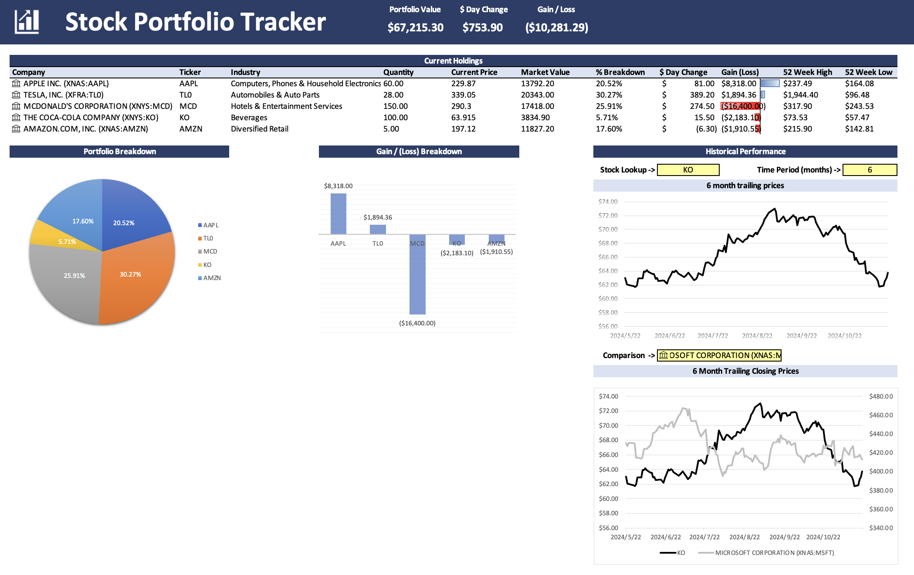

# Financial-Modeling-Portfolio

## DCF Calculation

1. Forecast the Free Cash Flow
2. Calculate the Weighted Average Cost of Capital
3. Calculate the Terminal Value
4. Discount the Free Cash Flow and Terminal Value
5. Calculate the Implied Share Price

## Stock Portfolio Tracker Dashboard

The dashboard includes a transactions tab to log buy or sell orders using Excel's stock feature. It calculates current holdings with key financial metrics like share price, 52-week high/low, and market value using formulas indlucing SUMIFS and FILTER. Visual summaries highlight portfolio facts, including share weight breakdowns and top winners/losers. Additionally, I built dynamic trend charts to track individual stock performance and compare the performance of two stocks over time. The dashboard can be auto updated by clicking the "refresh all" under the data tab.

